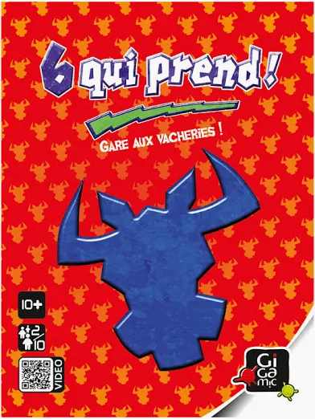

# 6 qui prend — Strategy Simulator

<p align="center">
  
</p>

Simulation engine for the card game **6 qui prend** (Take 6 / Category 5), built to find the best strategy through large-scale tournaments and ELO ranking.

## What it does

- Full game engine (104 cards, 4 rows, simultaneous play, correct penalty rules)
- 17 pluggable strategies, from trivial baselines to context-aware adaptive agents
- Parallel simulation via `multiprocessing` (~20× speedup)
- ELO rating system across 51 hand-crafted table compositions (255k+ games)

## Results

**ELO champion: `AdaptiveMeta` (1699)** — detects table aggressiveness from board fill rate and interpolates between HighestCard and MidRange styles dynamically.

| Rank | Strategy | ELO | Δ | Table wins |
|------|----------|-----|---|------------|
| 1 | AdaptiveMeta | 1699 | +199 | 7 |
| 2 | RegretMin | 1686 | +186 | 2 |
| 3 | MidRange | 1611 | +111 | 6 |
| 4 | HighestCard | 1591 | +91 | **17** |
| 5 | EndgameAware | 1590 | +90 | 1 |
| 6 | SafePlace | 1585 | +85 | 0 |
| 7 | PenaltyDodger | 1561 | +61 | 3 |
| 8 | GapHunter | 1518 | +18 | 2 |
| 9 | CardTracker | 1499 | −1 | 4 |
| 10 | CornerPusher | 1490 | −10 | 3 |
| … | … | | | |
| 17 | Equalizer | 1298 | −202 | 0 |

**Practical guide:**

| Situation | Best strategy |
|-----------|--------------|
| Unknown opponents | **AdaptiveMeta** |
| Want to avoid catastrophes | **RegretMin** |
| No HighestCard player at table | **MidRange** |
| Beginners / Random players at table | **HighestCard** |
| Greedy-heavy table | **CornerPusher** |

## Strategies

### Baselines
| Strategy | Logic |
|----------|-------|
| `Random` | Random card each turn |
| `LowestCard` | Always play lowest card |
| `HighestCard` | Always play highest card — bypasses full rows, lands on fresh ones |
| `MidRange` | Play card closest to median of row heads |

### Heuristic
| Strategy | Logic |
|----------|-------|
| `Greedy` | Minimize immediate expected penalty (avoid rows with 5 cards) |
| `Cautious` | Like Greedy but hard-penalizes any row with 5 cards (over-cautious) |
| `SafePlace` | Target the row with fewest cards (maximize distance from row limit) |
| `GapHunter` | Seek wide gaps above short rows — opponents fill the gap before you |
| `PenaltyDodger` | Minimize P(trigger) × row_penalty — avoid expensive collections |
| `Equalizer` | Keep all rows at similar length for a "stable" board |
| `CornerPusher` | Externalize triggers: play safe cards high to force opponents onto dangerous rows |

### Context-aware (use `GameContext`)
| Strategy | Logic |
|----------|-------|
| `CompositeScorer` | Weighted blend of 4 risk dimensions (trigger risk, density, penalty, card value) |
| `EndgameAware` | Play low early (many opponent cards in play), high late (rows won't fill anymore) |
| `ThreatAssessor` | Model rows as ticking bombs: P(explosion in N rounds) × penalty |
| `CardTracker` | Track seen cards to infer remaining opponent cards; exploit gap coverage |
| `AdaptiveMeta` | Detect table aggressiveness from fill rate; interpolate HighestCard ↔ MidRange |
| `RegretMin` | Minimax regret: minimize worst-case outcome, tiebreak on predictability |

## Project structure

```
sixquiprend/
├── game/
│   ├── card.py          # Card + penalty rules (bulls head values)
│   ├── deck.py          # 104-card deck, shuffled with seed
│   ├── board.py         # 4 rows, placement logic, snapshot
│   └── game.py          # Full game loop, builds GameContext per turn
├── strategies/
│   ├── base.py          # Strategy ABC + GameContext dataclass
│   └── *.py             # 17 strategy implementations
├── simulation/
│   └── runner.py        # Parallel tournament runner (multiprocessing)
├── analysis/
│   ├── compare.py       # Pure / mixed / H2H comparison
│   ├── ranked_points.py # 6-5-4-3-2-1 ranking points scoring
│   ├── matchup_matrix.py# Focal strat vs defined opponent profiles
│   └── mixed_table_elo.py # ELO across 51 table compositions
└── main.py              # Quick entry point
```

## Usage

```bash
# Quick tournament (6 random players, 10k games)
python main.py

# Full ELO analysis across 51 table compositions
python analysis/mixed_table_elo.py

# Matchup matrix (focal strat vs defined profiles)
python analysis/matchup_matrix.py
```

## Add a strategy

```python
# strategies/my_strategy.py
from strategies.base import Strategy, GameContext
from game.card import Card

class MyStrategy(Strategy):
    def choose_card(self, hand: list[Card], board: list[tuple[int,int,int]], ctx: GameContext | None = None) -> Card:
        # board = [(head_value, row_penalty, row_length), ...]
        # ctx.round_number, ctx.cards_seen_all_rounds, ctx.rounds_remaining, ...
        ...

    def choose_row(self, hand, board, card, ctx=None) -> int:
        # called when card < all row heads (forced take)
        ...
```

Then add it to `REGISTRY` in any analysis script.

## Requirements

Python 3.12+, no dependencies beyond stdlib.
